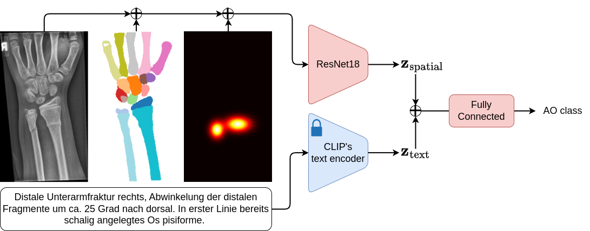

# A Systematic Analysis of Input Modalities for Fracture Classification of the Paediatric Wrist

## Overview
In this work, we systematically analyse the contribution of three modalities, namely automatic bone segmentation, fracture location, and radiology reports as additional input to the radiograph for fracture classification of the paediatric wrist within the AO/OTA system.



## Implementation
We rely on Clear-ML to manage and store our different models.
While it is possible, to rewrite the code to not use Clear-ML and store the models locally, we recommend to use Clear-ML since their free-plan is sufficient to reproduce our results.

### Environment
Our code is implemented in PyTorch using the PyTorch Lightning framework.
Please use the provided yaml (environment.yml) file to create the environment.

```bash
conda env create -f environment.yml
```

### Data
Please download the dataset using the provided link in the original [paper](https://www.nature.com/articles/s41597-022-01328-z) and preprocess it with their provided notebooks to obtain the 8-bit images. After this, please use our provided preprocessing script `dataset/copy_and_process_graz_imgs` to create the homogeneous dataset (all images flipped to left).
Place the metadata file in the `dataset.csv` file in the `data folder`.
Next use `dataset/create_cv_splits` to create the cross-validation splits.
Because we created the segmentation masks with a different method, we provide the segmentation masks, and you can download them [here](https://cloud.imi.uni-luebeck.de/s/QWp62SwZzbEniNN).
Since the radiology reports are not publicly available, we provide their CLIP embeddings [here](https://cloud.imi.uni-luebeck.de/s/Y79imrq2iWzQE4z).

## Training
To train the different input combinations, just execute the bash script `loop_over_input_comb.sh` where you have to specify the index of the GPU you want to use (0 if you only have one GPU).
The script will train all combinations of the input modalities and store the results in Clear-ML.
```bash
bash loop_over_input_comb.sh 0
```

## Evaluation
To evaluate the models, specify their model ids in `evaluation/clearml_ids.py` and precompute their prediction with `evaluation/predict.py`.
You can then finally obtain the quantitative results with `evaluation/quantitative.py`.
